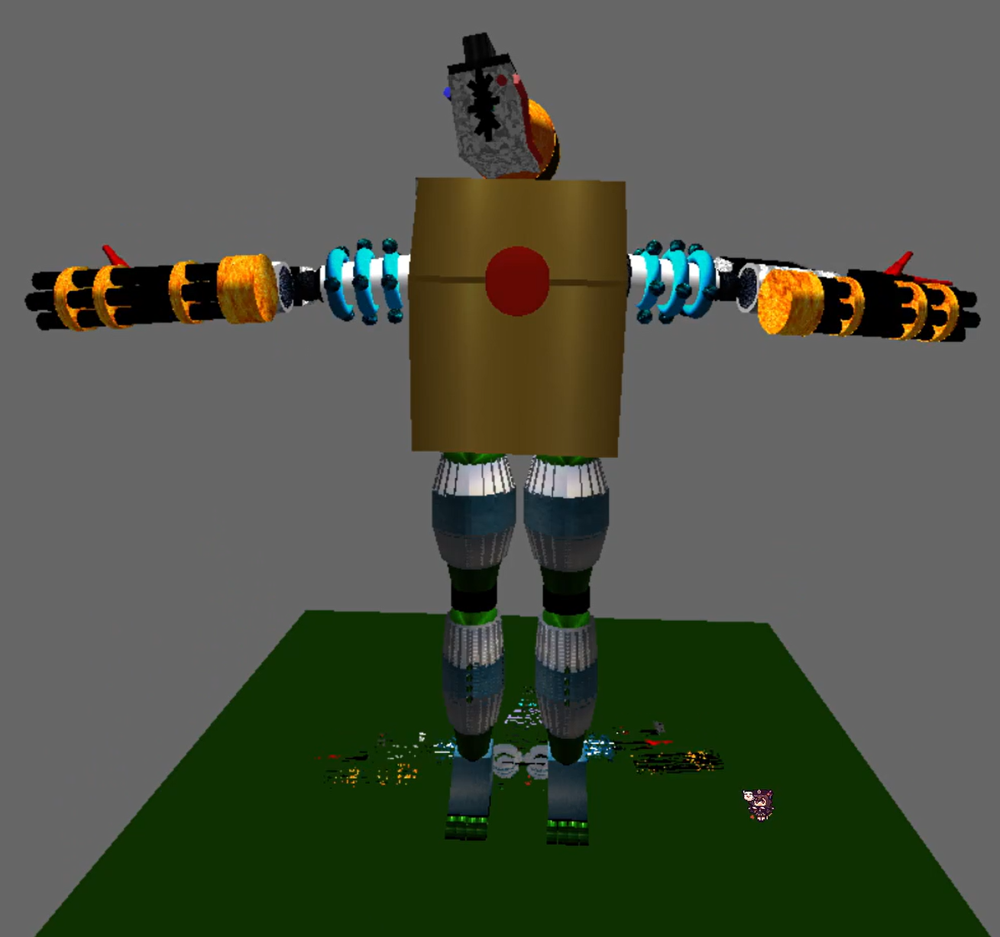

# Robot Project — Graphics Programming

A C++ OpenGL graphics programming project built for a **Computer Graphics / Graphics Programming** assignment. The application demonstrates hierarchical modelling, transformations, lighting, texture mapping, camera controls, and interactive 3D scene rendering using Win32 and OpenGL.

The project features a modular robot constructed from multiple articulated body parts alongside an experimentation station used to showcase graphics techniques and object manipulation.

## Highlights

- Designed and implemented a hierarchical 3D robot model using OpenGL.
- Built reusable robot components including arms, legs, head, body, shield, sword, and jetpack.
- Implemented translation, rotation, and scaling transformations.
- Added dynamic lighting, texture mapping, and shadow rendering.
- Created an experimentation station for testing graphics concepts and object manipulation.
- Integrated keyboard controls for camera movement and scene interaction.

## Technical Implementation

### Architecture

The project separates rendering, input handling, robot components, and scene management into focused classes:

```text
Application
├── Main ---------------- Window creation and render loop
├── InputManager -------- Keyboard input handling
├── Robot --------------- Main robot controller
│   ├── Head
│   ├── Body
│   ├── LeftArm
│   ├── LeftLeg
│   ├── Shield
│   ├── Sword
│   └── Jetpack
├── RobotPart ----------- Shared robot component functionality
└── ExperimentationStation
    ├── Environment Objects
    ├── Lighting Tests
    ├── Texture Demonstrations
    └── Transformation Controls
```

### Hierarchical Modelling

The robot is constructed using a parent-child hierarchy where transformations applied to a parent component affect all attached child components.

This approach enables:

- Articulated body construction
- Reusable robot parts
- Consistent scaling and positioning
- Efficient scene organization

### Graphics Features

The rendering system demonstrates several core computer graphics concepts:

- Hierarchical transformations
- Translation, rotation, and scaling
- Perspective projection
- Orthographic projection
- Texture mapping
- Dynamic lighting
- Shadow projection
- Camera navigation

### Rendering and Input

- **OpenGL** is used for all 3D rendering operations.
- **GLU** utility functions assist with camera setup and geometric primitives.
- **Win32 API** manages window creation and application events.
- **DirectInput** handles realtime keyboard input.
- The application follows a standard `input -> update -> render` loop structure.

## Controls

### Camera Controls

| Input | Action |
| --- | --- |
| Numpad `8` | Move Camera Up |
| Numpad `5` | Move Camera Down |
| Numpad `4` | Move Camera Left |
| Numpad `6` | Move Camera Right |
| Numpad `7` | Move Camera Forward |
| Numpad `1` | Move Camera Backward |

### Scene Selection

| Input | Action |
| --- | --- |
| `1` | Display Robot Scene |
| `3` | Display Experimentation Station |

### Experimentation Controls

| Input | Action |
| --- | --- |
| `W` / `S` | Move Up / Down |
| `A` / `D` | Move Left / Right |
| `Q` / `E` | Move Forward / Backward |
| `T` / `G` | Rotate Y Axis |
| `F` / `H` | Rotate X Axis |
| `R` / `Y` | Rotate Z Axis |
| `I` / `K` | Elbow Rotation Y |
| `J` / `L` | Elbow Rotation X |

## Technology Stack

- C++
- Object-Oriented Programming
- OpenGL
- GLU
- Win32 API
- DirectInput
- Visual Studio
- Windows SDK

## Building the Project

### Requirements

- Windows 10 or later
- Visual Studio with **Desktop Development for C++**
- Windows SDK
- OpenGL libraries
- DirectX SDK (for DirectInput)

### Steps

1. Clone the repository:

```bash
git clone https://github.com/yourusername/RobotProjectGraphicProgramming.git
```

2. Open `RobotProjectGraphicProgramming.sln`.

3. Select a Win32 build configuration.

4. Build and run the solution.

## Technical Highlights

- Implemented hierarchical modelling using parent-child transformations to construct an articulated robot.
- Built reusable robot components through a shared `RobotPart` architecture.
- Applied translation, rotation, and scaling transformations to individual and grouped objects.
- Implemented dynamic lighting and material properties using OpenGL's fixed-function pipeline.
- Added texture mapping with BMP textures to improve scene detail and visual quality.
- Implemented planar shadow projection techniques for environmental realism.
- Created an experimentation station for testing graphics concepts and object manipulation.
- Integrated DirectInput for responsive realtime keyboard controls.
- Supported both perspective and orthographic projection modes.

## Graphics Concepts Demonstrated

### Hierarchical Modelling

The robot is built using parent-child relationships. Transformations applied to parent components affect their children, allowing complex articulated movement.

### Lighting

The project utilizes OpenGL lighting techniques including:

- Ambient lighting
- Diffuse lighting
- Light positioning

### Texture Mapping

BMP textures are applied to robot components and environmental objects to improve visual quality and realism.

### Projection Modes

- Perspective Projection
- Orthographic Projection

### Shadow Rendering

Planar shadows are generated using projection matrices to enhance depth and scene realism.

## Screenshots

### Robot Model



### Experimentation Station


### Lighting Demonstration


### Textured Environment


### Shadow Rendering


## Author

Developed as part of a Graphics Programming / Computer Graphics coursework project using C++, OpenGL, and Win32 APIs.
